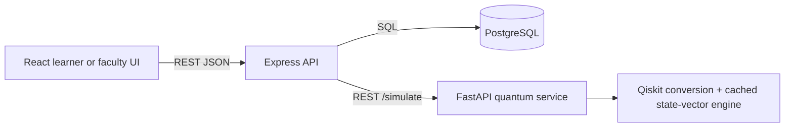

# Architecture Overview

The browser never calls PostgreSQL or Claude directly. Express owns authentication, authorization, retrieval, analytics, faculty scoping, and report generation. The FastAPI service validates circuit JSON, converts it to Qiskit when available, simulates state vectors, and returns analysis.
