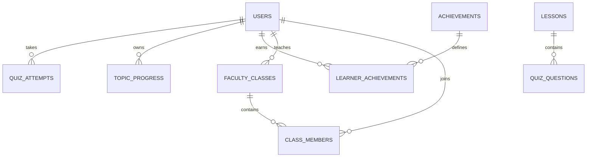

# Database and ER Overview

Core relationships:

The authoritative SQL is `backend/database/schema.sql`. All student-facing faculty queries join through `faculty_classes` and `class_members` to prevent cross-class access.
